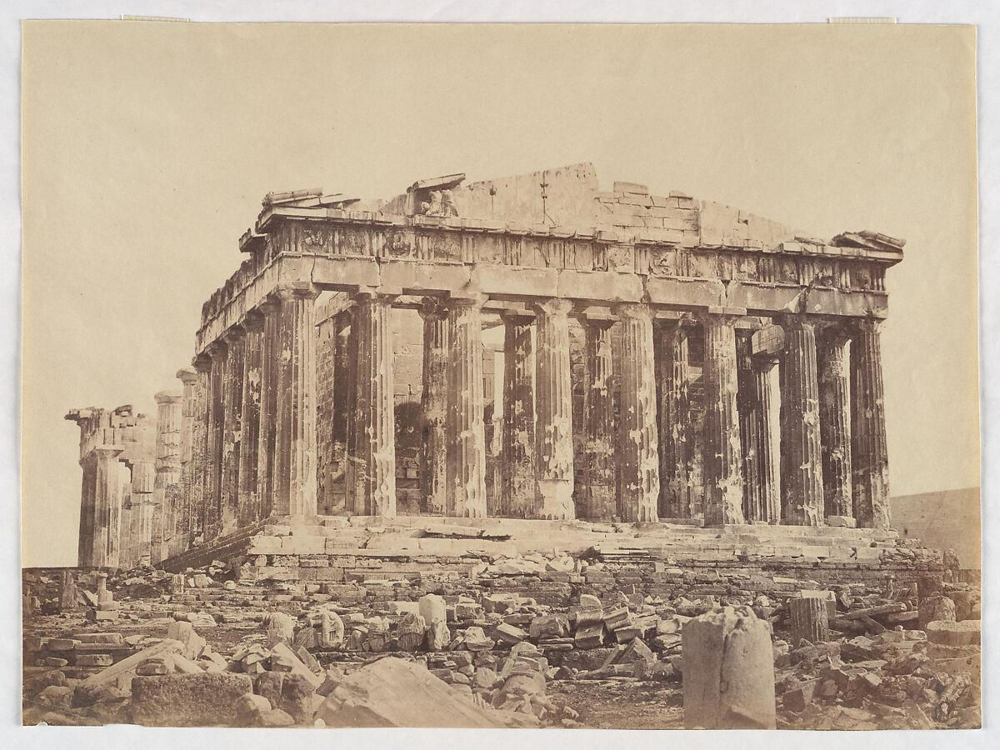

## Ian Javík / i4N

**Embedded System** / **Web** / **Art** / **History** 

  

  <em>Deus ex machina</a></em>

To Contact:

## Tech Stack

### Programming Languages

  
  
  
  

### Tools & Software

  
  
  
  
  
  
  
  
  
  

### Embedded System

  
  
  
  
  

### Web

  
  

### My beloved laptop

  

## Gallery

<table align="center">
  <tr>
    <td align="center">
      <em>Velocity: Design: Comfort</em> 
      Sweet Trip, 2003
    </td>
    <td align="center">
      <em>Long Season</em> 
      Fishmans, 1996
    </td>
  </tr>
  <tr>
    <td align="center"></td>
    <td align="center"></td>
  </tr>
</table>
 

---

  <em>Impressions to ideas. 
  Situations to subjects. 
  Brief flights to sustained ones. 
  Exceptions to types.</em>

