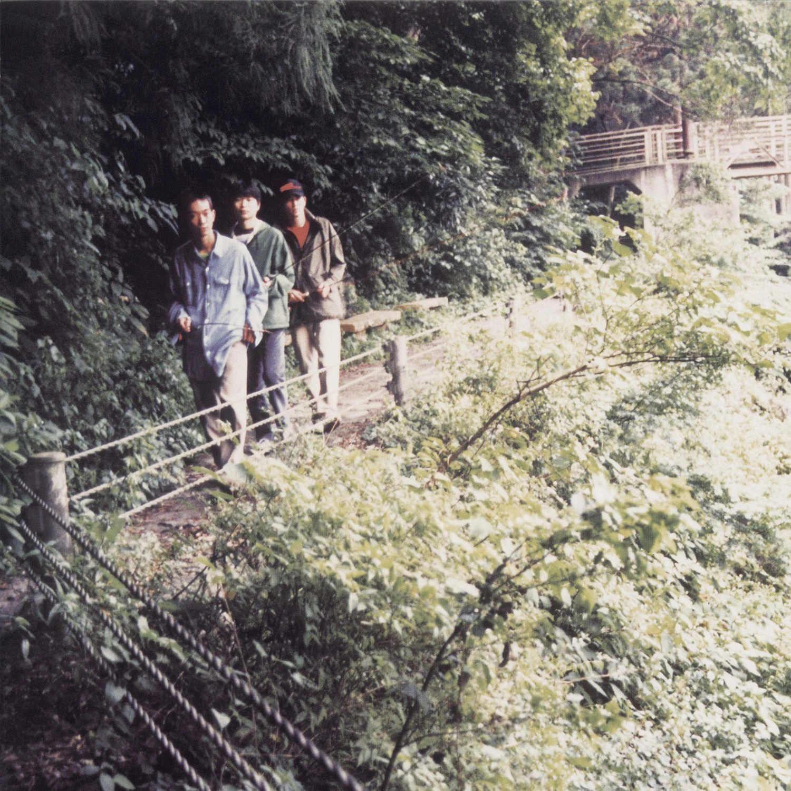

<h2 align="center">Ian Javík / i4N / Fer Doirich</h2>

Ríastrad!

<h2 align="center">Good Products</h2>

  &nbsp;&nbsp;

<h2 align="center">Gallery</h2>

<table align="center">
  <tr>
    <td align="center">
      <em>Velocity: Design: Comfort</em> 
      Sweet Trip, 2003
    </td>
    <td align="center">
      <em>Long Season</em> 
      Fishmans, 1996
    </td>
  </tr>
  <tr>
    <td align="center"></td>
    <td align="center"></td>
  </tr>
</table>
 

---

  <em>Impressions to ideas. 
  Situations to subjects. 
  Brief flights to sustained ones. 
  Exceptions to types.</em>

