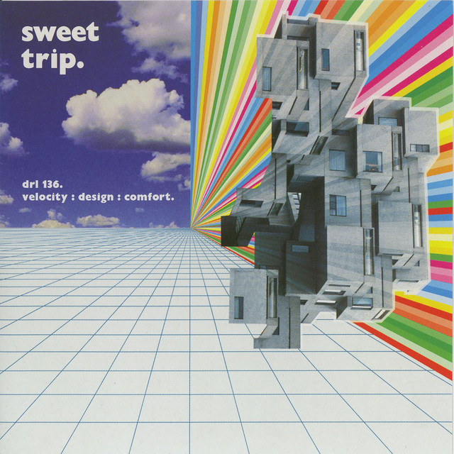
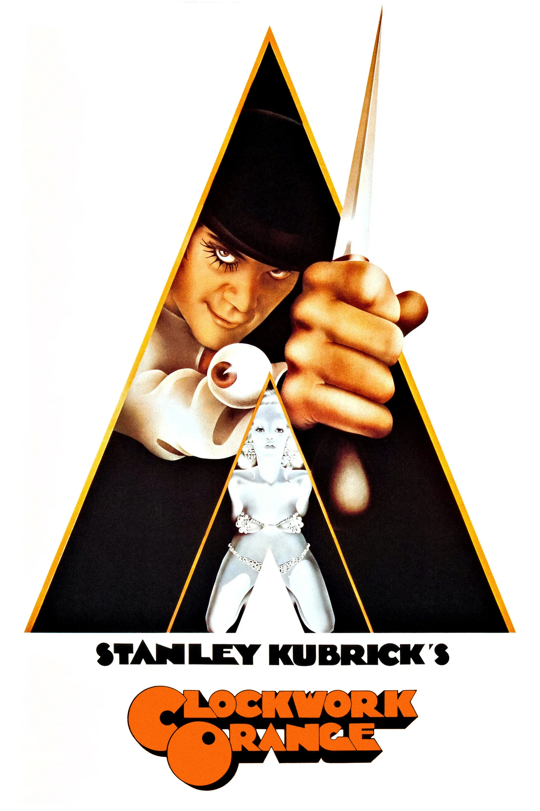

## 关于我
[English](README.md) | 中文 

---

大三EE在读，喜欢**电子 DIY**、**科技数码**、**艺术**和**音乐**（摇滚 / 电子 / 实验）。目前在学习**嵌入式 Linux** 和 **MCU** 开发 — 同时也（试图）涉猎**前端**、**深度学习**和**网络安全**。 

正在寻找实习岗位：

- ESP32 / STM32
- BSP / 业务
- ioT / AI / UI / ...
- 广深月内到岗

欢迎通过以下方式联系：

    

## 技术栈
### 编程语言
    

### 工具与软件
        

### 嵌入式
     

### Web
 

### 非常好机器

## 非常好专辑

  <em>Velocity: Design: Comfort</em> 
  Sweet Trip, 2003  
  

## 非常好电影

  <em>发条橙</em> 
  Stanley Kubrick, 1971  
  

 

----

  <em>Impressions to ideas. 
  Situations to subjects. 
  Brief flights to sustained ones. 
  Exceptions to types.</em>

